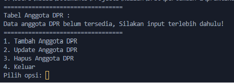

# LP1DPBO2024C1

Saya Muhamad Sabil Fausta NIM 2210142 mengerjakan Latihan 1 dalam mata kuliah Desain dan Pemrograman Berorientasi Objek
untuk keberkahanNya maka saya tidak melakukan kecurangan seperti yang telah dispesifikasikan. Aamiin.

# Desain Program

Program yang saya buat menggunakan konsep OOP (Object Oriented Programming) yang mana terdapat 1 class yaitu sebgai representasi dari Anggota DPR
terdapat beberapa atribut yang dimasukan sesuai dengan spesifikasi dan juga yang saya tambahkan :

id: Atribut ini merupakan pengidentifikasi unik untuk setiap anggota DPR. id digunakan untuk membedakan antara satu anggota dengan anggota lainnya.

nama: Atribut ini menyimpan nama dari anggota DPR tersebut.

umur: Atribut ini merepresentasikan umur anggota DPR dalam tahun.

jabatan: Atribut ini menyimpan informasi tentang jabatan yang dipegang oleh anggota DPR tersebut dalam lembaga. Jabatan bisa berupa "Ketua", "Wakil Ketua", "Sekretaris", atau jabatan lainnya sesuai dengan struktur organisasi DPR.

namaBidang: Atribut ini menunjukkan bidang atau komisi yang diwakili oleh anggota tersebut. Setiap anggota DPR biasanya bertanggung jawab dalam satu atau beberapa bidang tertentu, seperti "Ekonomi", "Hukum", "Pendidikan", dan lain-lain.

namaPartai: Atribut ini menyimpan nama partai politik yang diwakili oleh anggota tersebut. Di banyak sistem parlementer, anggota DPR berasal dari berbagai partai politik, dan atribut ini merefleksikan afiliasi politik dari masing-masing anggota.

# Alur Program

Pertama, user disajikan dengan data yang tersedia/sudah diinput, jika data masih kosong maka akan seperti gambar diatas terdapat pesan bahwa data masih belum tersedia dan mesti input terlebih dahulu via opsi yang sudah disediakan dibawahnya
